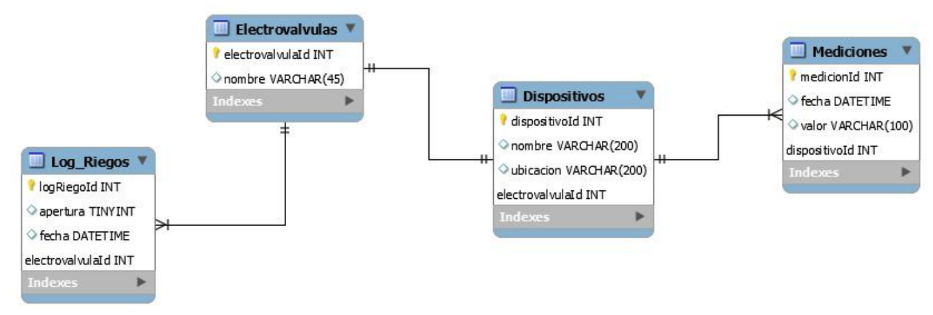
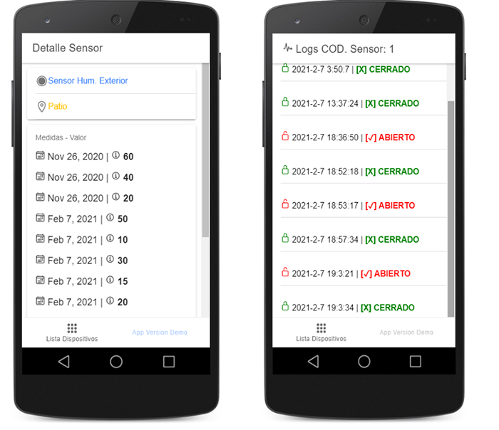

## Proyecto DAM - IOT - UBA

Autor:
* Iván Cruz Flores

Docente:

* Brian Ducca


## Este proyecto esta formado por:
* Backend: Express Js.
* Frontend: Ionic.
* Base Datos: Sqlite.

## Dashboard Principal:
Vista principal de la aplicación:


## Prerequisitos para el proyecto:
* Node js
* Express js
* Npm
* Ionic
* Sqlite


## Instalacion de dependencias:
Despues de clonar el repositorio se debe instalar las dependencias npm:

1.- Usando la terminal ubicarse dentro de la ruta del Backend.
```
cd TP-DAM/API/

npm install
```
2.- Usando la terminal ubicarse dentro de la ruta del Frontend
```
cd TP-DAM/front/myApp/

npm install

```

## Instrucciones de uso:
1.- Para levantar el backend, en la terminal ubicarse dentro del directorio del backend y ejecutar:
```diff

node index.js

- "Para algun cambio en index.js, detener el servicio y volver a ejecutarlo"
```

2.- Para levantar el frontend, en la terminal ubicarse dentro del directorio del frontend y ejecutar:
```diff
ionic serve

- "Para levantar el frontend demora de 5min a 10 min
```

## Urls Importantes: 
* Backend: http://localhost:3001/
* Frontend: http://localhost:8100/
 

## Base de datos:
Para la persistencia de datos se usa:

* Base de datos: DAM (Archivo local)

* Esquema relacional:



##  Herramienta de Base de datos:
El archivo de BD esta dentro del directorio llamado API y para visualizar sus valores se usó DB Browser SqLite.
* DB Browser for SQLite: https://sqlitebrowser.org/


## Operaciones API
* http://localhost:3001/inicializar/ : inicializar los valores por defecto cuando la BD esta vacia.
* http://localhost:3001/mediciones/:id : retorna un JSON con los datos del registro de mediciones por código ID.
* http://localhost:3001/dispositivos/ : retorna JSON con los dispositivos de la Base de Datos.
* http://localhost:3001/dispositivosCompletos/: devuelve JSON con consulta cruzada entre el sensor y sus mediciones.
* http://localhost:3001/valorMasActualDispositivo/:id : retorna un JSON con la tabla filtraba de mediciones.
* http://localhost:3001/listaLogsCompleta/ : retorna un JSON con todos los registros de la tabla log.
* http://localhost:3001/listaLogs/:id retorna un JSON con los resgitros log del código ID.
* http://localhost:3001/addMediciones/:fecha/:valor/:dispositivoId : registra una nueva medición.
* http://localhost:3001/addLogDispositivo/:estado/:fecha/:electrovalvulaId: registra un nuevo registro log.
* http://localhost:3001/addDispositivo/:nombre/:ubicacion/:electrovalvulaId : registra un nuevo dispositivos.

## Operaciones Frontend:
* Listar dispositivos en la pantalla.
* Visualiza un gráfico de valvula del último valor del sensor seleccionado.
* Listar los registros de las medidas del sensor seleccionado.
* Listar los registros del logs del sensor seleccionado.
* Detectar el estado actual del sensor Abierto/Cerrado.
* Registrar en los logs cuando se abre la Electrovalvula.
* Registro del ultimo valor de medición.
* Registrar en los logs y en mediciones cuando se cierra la Electrovalvula.

## GUI de la App:
Listado de sensores.


Listado de mediciones y logs.



Estados de la electrovalvula.


Alerta y operaciones de apertura y cierre de la electrovalvula.


## Demostración de Funcionamiento:
* Funcionamiento.

 https://youtu.be/WzM2C-YNq6I


## Licence:

This project is published under GPLV3+ licence.


