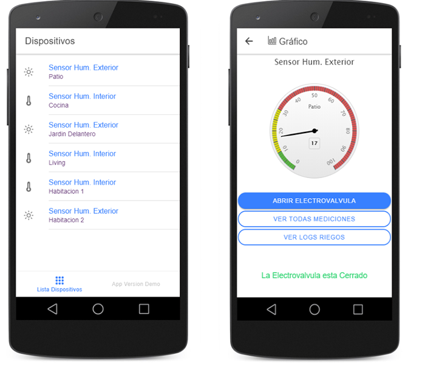

## Proyecto DAM - IOT - UBA

Autor:
* Ivan Cruz Flores

Docente:

* Brian Ducca


## Este proyecto esta formado por:
* Backend: Express Js.
* Frontend: Ionic.
* Base Datos: Sqlite.

## Dashboard Principal
Vista principal de la aplicación:


## Prerequisitos para el proyecto
* Node js
* Express js
* Npm
* Ionic
* Sqlite


## Instalacion de dependencias
Despues de clonar el repositorio se debe instalar las dependencias npm:

1.- Usando la terminal ubicarse dentro de la ruta del Backend.
```
cd TP-DAM/API/

npm install
```
2.- Usando la terminal ubicarse dentro de la ruta del Frontend
```
cd TP-DAM/front/myApp/

npm install

```

## Instrucciones de uso
1.- En la terminal del Backend
```diff

node index.js

- "Para algun cambio en index.js, detener el servicio y volver a ejecutarlo"
```

2.- En la terminal del Frontend
```diff
ionic serve

- "Para levantar el frontend demora de 5min a 10 min
```

## Urls Importantes: 
* Backend: http://localhost:3001/
* Frontend: http://localhost:8100/
 

## Base de datos:
Para la persistencia de datos se usa:

* Base de datos: DAM (Archivo local)

Esquema relacional:


##  Herramienta de Base de datos:
El archivo de BD esta dentro del directorio llamado API y para visualizar sus valores se usó DB Browser SqLite.
* DB Browser for SQLite: https://sqlitebrowser.org/


## Operaciones API
* http://localhost:3001/dispositivos/ : retorna json con los dispositivos de la BD.
* http://localhost:3001/dispositivosCompletos/: devuelve mediciones de sensor.
* http://localhost:3001/inicializar/ : inicializar los valores por defecto cuando la BD esta vacio.
* http://localhost:3001/mediciones/:id : retorna los datos del registro codigo id.
* http://localhost:3001/addDispositivo/:nombre/:ubicacion/:electrovalvulaId : registra dispositivos.

## Operaciones Frontend
* Diseno de la interfaz gráfica.
* Listar dispositivos en la pantalla.
* Listar el detalle de cada sensor seleccionado.

## GUI de la App
Listado de sensores


## Demostración de Funcionamiento
* Funcionamiento en emulador.
 https://youtu.be/ubd_LJ9voYU  
* Funcionamiento en navegador.
 https://youtu.be/ZMwUW98ipAo

## Licence

This project is published under GPLV3+ licence.


